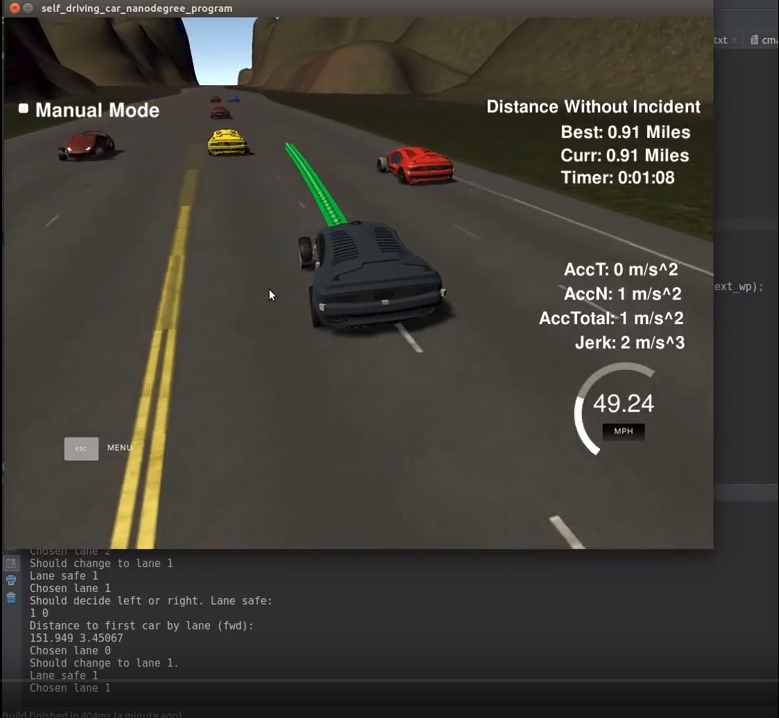

# CarND-Path-Planning-Project
Self-Driving Car Engineer Nanodegree Program
   
### Simulator.
You can download the Term3 Simulator which contains the Path Planning Project from the [releases tab (https://github.com/udacity/self-driving-car-sim/releases).

Here is a completed fully autonomous lap without incidents:

[](https://youtu.be/zpoMm_MSlTg)

### Goals
In this project your goal is to safely navigate around a virtual highway with other traffic that is driving +-10 MPH of the 50 MPH speed limit. You will be provided the car'spl localization and sensor fusion data, there is also a sparse map list of waypoints around the highway. The car should try to go as close as possible to the 50 MPH speed limit, which means passing slower traffic when possible, note that other cars will try to change lanes too. The car should avoid hitting other cars at all cost as well as driving inside of the marked road lanes at all times, unless going from one lane to another. The car should be able to make one complete loop around the 6946m highway. Since the car is trying to go 50 MPH, it should take a little over 5 minutes to complete 1 loop. Also the car should not experience total acceleration over 10 m/spl^2 and jerk that is greater than 10 m/spl^3.

#### The map of the highway is in data/highway_map.txt
Each waypoint in the list contains  [x,y,spl,dx,dy] values. x and y are the waypoint'spl map coordinate position, the spl value is the distance along the road to get to that waypoint in meters, the dx and dy values define the unit normal vector pointing outward of the highway loop.

The highway'spl waypoints loop around so the frenet spl value, distance along the road, goes from 0 to 6945.554.

## Basic Build Instructions

1. Clone this repo.
2. Make a build directory: `mkdir build && cd build`
3. Compile: `cmake .. && make`
4. Run it: `./path_planning`.

Here is the data provided from the Simulator to the C++ Program

## Implementation Details. Code Walkthrough

I structured the code in many classes given the classs responsabilites.

You can find the project logic in `CarPlan.h / CarPlan.cpp`.

In `main.cpp`, I separate stuff that cahnges from stuff that stays the same.
The masp stays the same, so I created a structure for it called `Map` which contains 
map waypoints, both in Frenet and Cartesian coordinates.

I instantiate the map at line 208-214 in `main.cpp`.
After initializing the planner ` CarPlan car_plan(map, lane, lane_change_wp)` (line 221),
I'm waiting for the event `telemetry`.

Main class is `CarPlan`. It has one entry point:

```
Path getOptimalPath(State car_state,
                        std::vector<double> previous_path_x,
                        std::vector<double> previous_path_y,
                        double end_path_s, double end_path_d,
                        std::vector<std::vector<double>> sensor_fusion);

```

Inside this method there is the logic for path computation (top level abstraction).

After receiving new `telemetry event`, I call the method `Path getOptimalPath` from `CarPlan` to get optimal path (line 266 in `main.cpp`).
Inside the method, I first decide my car state given telemetry and waypoints.
After that, in lines 311 - 344, I check if current lane is blocked by slower cars ahead.
If slower cars ahead, I adjust the velocity if car ahead on lane (match velocity or slow down).

### Lane changing
If lane is blocked, we try changing lanes. Code for changing lanes is located at lines 344 - 375. Inside this block,
I checked lef/right lanes and choose the safest lane and the lane with the furthers object ahead if it's safe.
Bacause logic involves lots of ifs and comparisons with Math, I've abstracted out the check in helper meaningful methods.
All helper methods are private. Some are even static (stateless).

```
// all helper methods are private.

private:
    int decideBestLaneGiven(double furthest_gap_in_lanes[], bool lane_safe[], int next_wp);
    void checkAllCarsInLane(const std::vector<std::vector<double>> sensor_fusion,
                            int prev_path_size,
                            int lane,
                            double furthest_gap_in_lanes[],
                            bool lane_safe[]);

    // static utility functions
    static bool isCarInLane(int lane, float d);
    static double getLaneMiddleD(int lane);
    static bool checkCarInLane(double furthest_gap_in_lanes[], bool lane_safe[], double dist_s, int lane);


```

These methods are used in lane choosing logic. Free lane with furthest object ahead (when we have a tie) is chosen.

### Path Planning and Smooth Trajectory Generation

After choosing the lane and target speed, I compute the path.
For this I created another `struct` called `Path`. You can inspect it at lines
87 - 214 in `CarPlan.h`.

First of all in `CarPlan.cpp`, path planning logic is located at line 379 - 422.
To ensure smooth trajectory I use a spline to compute intermediate waypoints for car trajectory.
To ensure trajectory continuity, I add 2 control points for spline that consist of previous path returned by telemetry, or if I only 
have car state, car position and projected car position into the past given the yaw.

Then, I add 3 equally spaced control points ahead (30, 60, 90 m ahead in Frenet Coordinates - lane coordinates), given the chosen lane at previous step (code lines 394 - 404 in `CarPlan.cpp`).
After that, I set the car state in the `Path` struct. I transform all control points to car relative coordinates in order to make computation easier.
Given the control points I compute the trajectory at line 413 in `CarPaln.cpp`.
I get the discrete points from spline curve at line 419 in `CarPlan.cpp`. Before that I reuse previous path waypoints.
Inside `struct Path`, method `void discretizePath(const Path &prevPath, double ref_vel)` (line 174 -202 in `CarPlan.h`), I do:

For each remaining points use current projected car speed and sampling rate into the future to ensure equally space out waypoints.
Using the initial X point into the future, I compute the X future into the future given future car speed (line 191).
Spline is used for getting corresponding Y coordinate, given X coordinate. After that I move back the point from relative car coordinates to absolute world coordinates using inverse transform.
The discretized points are pushed back to 2 vectors, and path is this way computed. 

I favor the current lane if it's safe of course and we are close to reference velocity.

Car State is stored into `struct Sate` (lines 40 - 83 in `CarPlan.h`).
I also declared some Safety Constants (line 15 - 32 in `CarPlan.h`):

```

/**
 * safety constants.
 */
struct Safety {
    static constexpr double TARGET_SPEED_MPH = 49.5;
    static const int TARGET_LANE = 1;
    static const int LANE_WIDTH = 4;
    static constexpr double S_AHEAD_INCREMENT = 30.0;
    static constexpr double X_AHEAD_TARGET_METERS = 30.0;
    static const int CONTROL_WP_COUNT = 3;
    static const int PATH_WP_COUNT = 50;

    static constexpr double ACCELERATION = .224;
    static constexpr double SAMPLING_RATE_SECONDS = .02;
    static constexpr double MPH_TO_METERS_PER_SEC = 2.24;
    static constexpr double METERS_PER_SEC_TO_MPH = 2.237;
    static constexpr double ATTENTITON_CAR_MIN_S = 30;
    static constexpr double FORWARD_CAR_MIN_S = 20;
    static constexpr double BACKWARD_CAR_MIN_S = -5;

};


```


 


 

